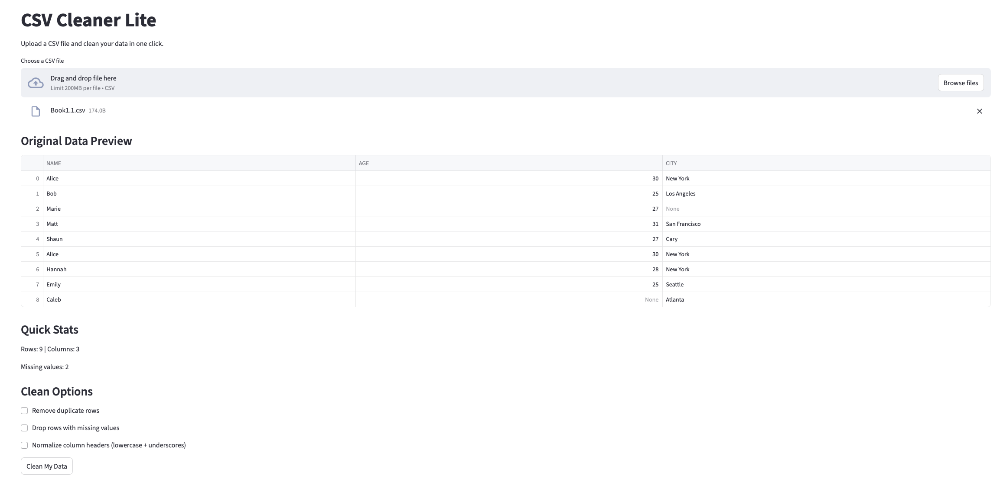
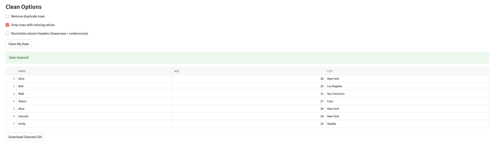
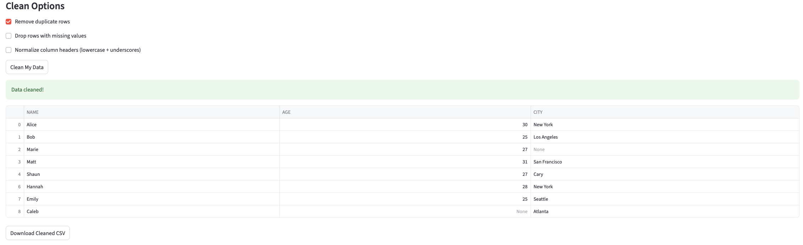
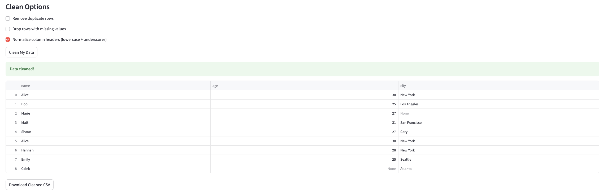
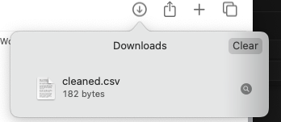
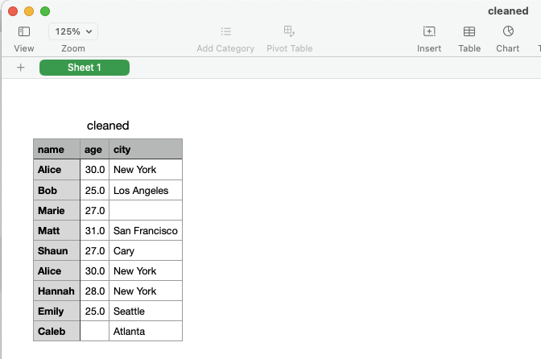

# CSV Cleaner Lite

A beginner-friendly web app to upload, preview, and clean CSV files — no Excel formulas needed.

## Features
- Upload any `.csv` file (up to 200MB)
- Remove duplicate rows
- Drop rows with missing values
- Normalize column headers (e.g., `First Name` → `first_name`)
- Preview your data before and after cleaning
- Download the cleaned file instantly

## Demo

### 1. Upload a CSV file & Preview the Data

### 2. Choose Cleaning Options



### 3. Download Cleaned File



## Freelance Use Case

Perfect for clients who:
- Work with messy spreadsheets
- Need quick data validation
- Want to clean and download data without touching Excel

## Built With
- Python
- Pandas
- Streamlit

## Run Locally

```bash
pip install -r requirements.txt
streamlit run app.py
